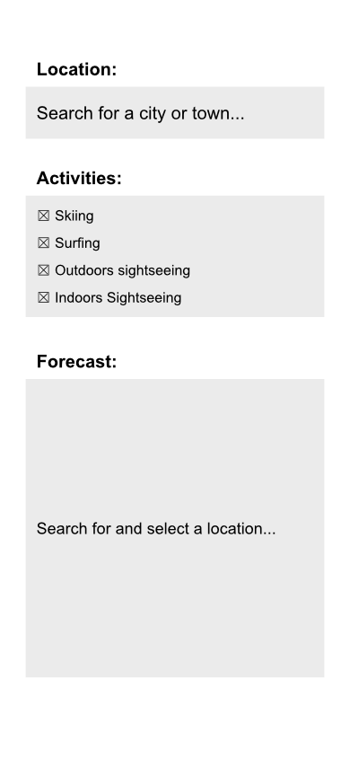
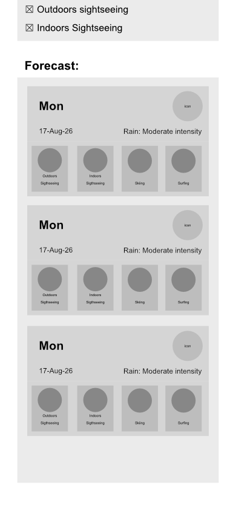
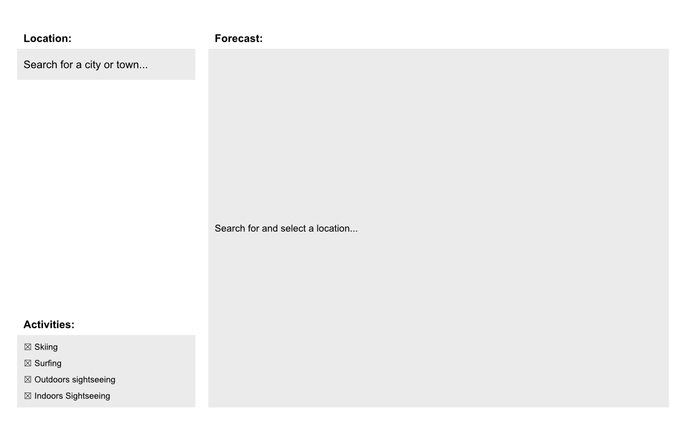
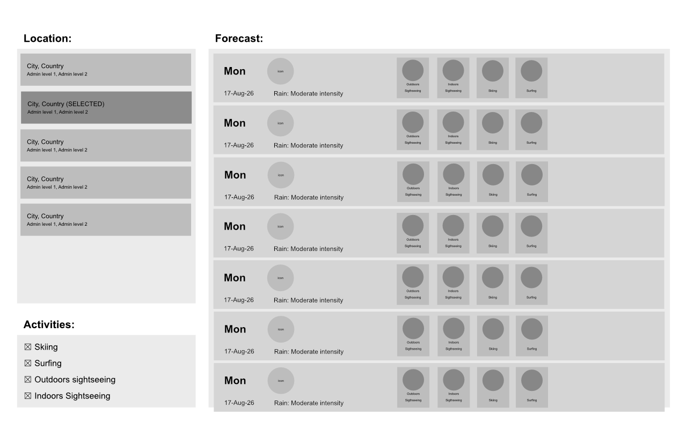

# Ranked Activities Frontend

## Architecture overview and technical choices

React + TypeScript + Vite Single Page Application, no UI framework or component library, plain CSS with media queries (mobile-first, `768px` breakpoint) per the project's "bare minimum responsiveness" scope.

- **Component structure**: three top-level feature components (`Location`, `Activities`, `Forecast`), each in its own folder with a co-located `.css` file. Nested sub-components (`LocationResults`, `ForecastDay`, `ForecastActivities`) live inside their parent's folder.
- **State**: lives in the top-level `App` component (search query, selected location, selected activities) and is passed down as props, no context or state library, although they would be considered if/when scaling the SPA.
- **Data fetching**: Apollo Client v4 (`@apollo/client` + `@apollo/client/react`), `InMemoryCache`, a single `HttpLink` pointed at `http://localhost:4000`. Two typed queries (`SEARCH_LOCATIONS`, `GET_WEEKLY_FORECAST`) live under `src/graphql/`, hand-written to match the backend schema (see Trade-offs re: codegen).
- **Location search**: debounced (300ms) and gated behind a 2-character minimum before firing a query, to avoid a request per keystroke.
- **Activity filtering**: checking/unchecking an activity drives the `only` argument on the nested `activities` field of `getWeeklyForecast`, so unticking an activity removes it from every returned day server-side rather than just hiding it client-side (purposeful choice merely to expand GraphQL usage).
- **Layout**: CSS Grid on the app shell. Mobile stacks Location/Activities/Forecast vertically; `≥768px` switches to a two-column layout.

## How AI assisted

Built entirely with Claude Code as a pair-programming assistant throughout:

- Wireframe screenshots (mobile + tablet) were fed to the assistant to scaffold component structure and CSS Grid/Flexbox layout, and for some layout corrections.
- The backend's GraphQL `typeDefs` were pasted in directly so the assistant could hand-write matching typed queries and TS interfaces instead of guessing the shape.
- Every screen/interaction was verified by the assistant launching the Vite dev server and driving it with a headless browser (Playwright).
- All UX/architecture decisions (state placement, component boundaries, breakpoint behavior, what to omit) were directed and reviewed at each step, never accepted "as-is".

## Omissions & Trade-offs

### Omitted features or polish

- **No real weather icons**: the forecast day's weather icon and the activity-score icons (✓✓ / ✓ / ✕) are flat-color placeholders, not illustrated icons mapped from `weather_code`.
- **No error UI**: `useQuery`'s `error` state isn't surfaced anywhere (Location search or Forecast); a failed request just renders as "No results" / "No forecast available".
- **No cache/fetch-policy tuning beyond Apollo's defaults**: `cache-first` is used as-is.
- **No tests**: no unit/component tests were added for the frontend (unlike the backend, which has Jest coverage). Skipped given time constraints, prioritizing wiring the full search → select → forecast flow end-to-end.
- **No accessibility pass beyond basics**: results/checkboxes are real `<input>` / `<button>` elements (keyboard/focus work) and the weather/activity-score icons carry `role="img"` + `aria-label` text alternatives, but there's still no live region announcing loading/result changes as they happen.

### Shortcuts taken and how I'd fix them

- **Apollo Client's URI is hardcoded** (`http://localhost:4000`) in `src/apolloClient.ts`. Fix: read from a Vite env var (`import.meta.env.VITE_GRAPHQL_URL`) so it's configurable per environment.
- **GraphQL types are hand-written to mirror the backend schema** rather than generated (same trade-off as the backend). Fix: introduce `graphql-codegen` if the schema is expected to change often, to keep types and queries in sync automatically.
- **Weather-icon and activity-score-icon colors are hardcoded hex values** rather than theme tokens, since they're meant to stay constant across light/dark mode. Fix: centralize them as named CSS custom properties (e.g. `--score-high`, `--score-low`) instead of literal hex values scattered across two `.css` files, for easier future retheming.

## Wireframe Images
### Mobile - Initial state

### Mobile - Displaying results

### Bigger screens - Initial state

### Bigger screens - Displaying results

